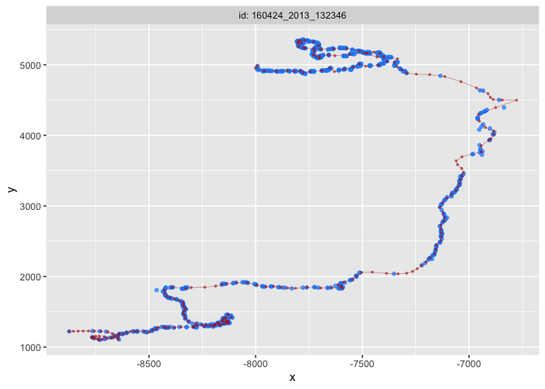
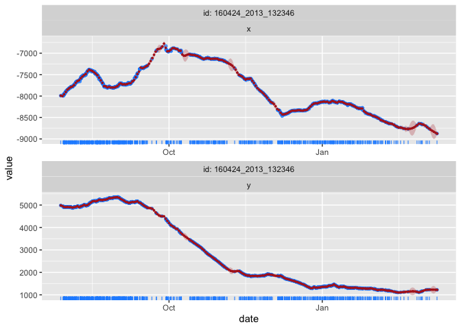
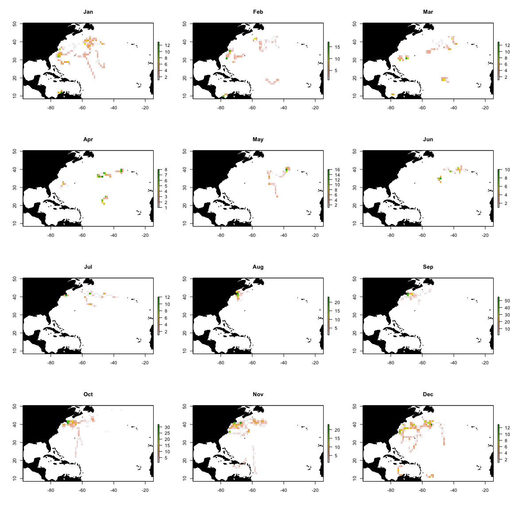
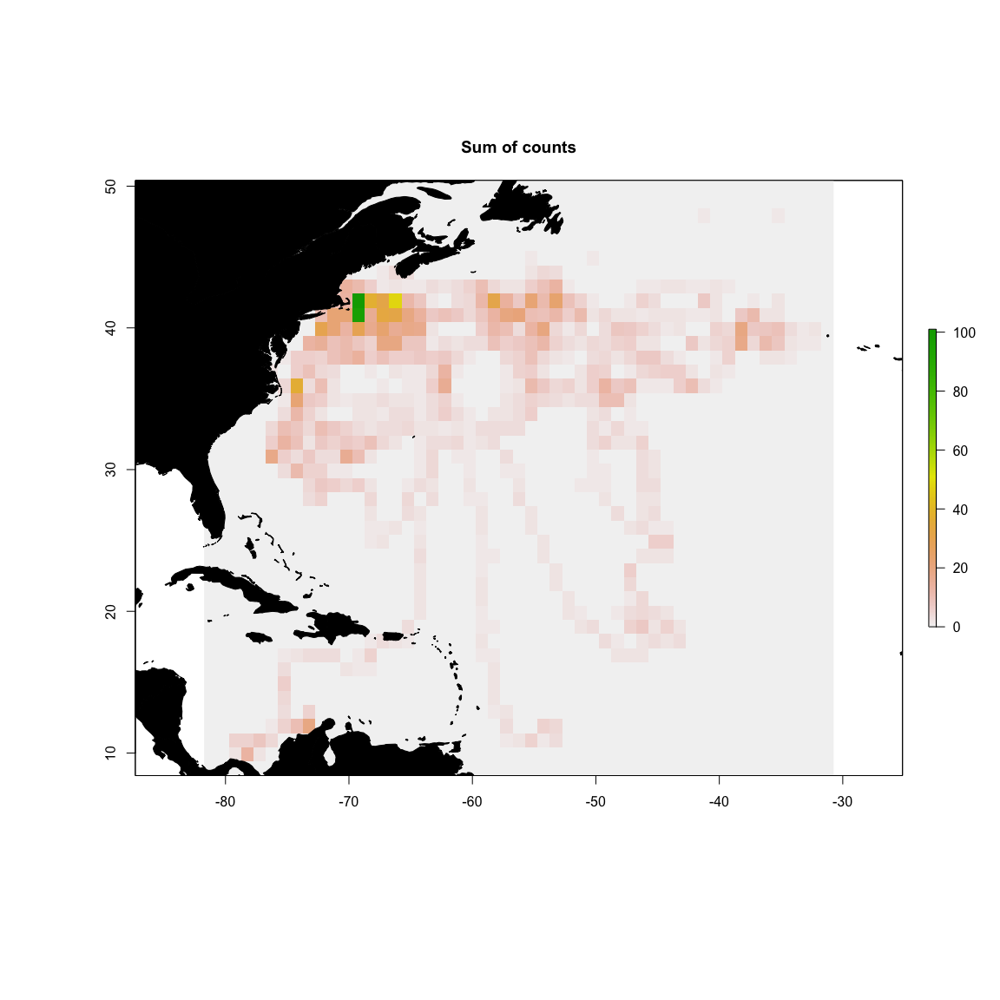

Biologging levels of standardization
================

html\_document: df\_print: paged

``` r
library(sp)
library(tidyverse)
library(raster)
library(lubridate)
library(fields)
library(foieGras)
```

The data used here are a published set of … from DataOne at DOI:
xxx

## Level 1 -\> 2

``` r
fList <- list.files('./data_level1/', full.names = TRUE, recursive = TRUE)
loc_files <- fList[grep('Locations', fList)]

## this metadata is from the DataOne repo at doi: xxx
meta <- read.table('Braun_atn_tag_deployment_metadata.csv', sep = ',', header = TRUE, stringsAsFactors = FALSE)
meta$Deployment.Start.Datetime <- as.POSIXct(meta$Deployment.Start.Datetime, format = '%m/%d/%y %H:%M', tz = 'UTC')
meta$Deployment.Stop.Datetime <- as.POSIXct(meta$Deployment.Stop.Datetime, format = '%m/%d/%y %H:%M', tz = 'UTC')

for (i in 1:length(loc_files)){
  
  ## read and format raw location data
  track <- read.table(loc_files[i], sep = ',', header = TRUE)
  track <- track[,c('Ptt','Date','Type','Quality','Latitude','Longitude')]
  track <- track[which(track$Quality != 'Z' & track$Quality != ' '),]
  track$Date <- lubridate::parse_date_time(track$Date, orders = c('HMS dbY', 'mdy HM', 'Ymd HMS'), tz = 'UTC')
  
  ## removes duplicate POSIXct timestamps (not duplicate DAYS)
  track <- track[which(!duplicated(track$Date)),]

  ## identify metadata row
  meta_idx <- which(meta$PTT %in% track$Ptt[1])
  
  ## identify start stop timestamps
  start <- meta$Deployment.Start.Datetime[meta_idx]
  stop <- meta$Deployment.Stop.Datetime[meta_idx]

  ## add tagging location to track dataframe
  tag <- as.data.frame(cbind(track$Ptt[1], NA, NA, 3, meta$geospatial_lat_start[meta_idx], meta$geospatial_lon_start[meta_idx]))
  colnames(tag) <- names(track)
  tag$Date <- start
  track <- track[which(track$Date >= tag$Date),]
  track <- rbind(tag, track)
  track <- track[order(track$Date),]
  track <- track[which(track$Date >= start & track$Date <= stop),]

  ## create spatial points for filtering
  tr <- track
  coordinates(tr) <- ~Longitude + Latitude
  proj4string(tr) <- CRS("+proj=longlat +ellps=WGS84 +datum=WGS84")

  ## then to trip object
  tr <- trip::trip(tr, c('Date','Ptt'))
  
  ## filter at 4 m/s or 14.4 km/hr
  ## speed filter decision based on Fig S1 in Braun CD, Galuardi B, Thorrold SR (2018) HMMoce: An R package for improved geolocation of archival-tagged fishes using a hidden Markov method. Methods Ecol Evol 9:1212–1220
  sf2 <- trip::speedfilter(tr, max.speed = 14.4)
  
  
  ## subset track based on logical output of speed filter
  df <- data.frame(tr[sf2,])[,c(2,4:6)]
  names(df) <- tolower(names(df))
  names(df) <- c('date','argos_lc','lat','lon')
  df$deploy_id <- meta$Deployment.ID[meta_idx]
  df <- df[,c(5,1:2,4,3)]
  
  ## plot to compare
  
  
  ## write level 2 data results
  write.table(df, paste('./data_level2/', meta$Deployment.ID[meta_idx], 'pnas_atn.csv', sep=''), sep=',', col.names = TRUE, row.names = FALSE)
  
  print(paste(meta$Deployment.ID[meta_idx], 'complete.', sep = ' '))
  
}
```

    ## [1] "160424_2016_106744 complete."
    ## [1] "160424_2016_106745 complete."
    ## [1] "160424_2016_106746 complete."
    ## [1] "160424_2016_106747 complete."
    ## [1] "160424_2016_106748 complete."
    ## [1] "160424_2013_132346 complete."
    ## [1] "160424_2014_141195 complete."
    ## [1] "160424_2015_141261 complete."
    ## [1] "160424_2016_141262 complete."
    ## [1] "160424_2016_141263 complete."
    ## [1] "160424_2015_141264 complete."
    ## [1] "160424_2016_141265 complete."
    ## [1] "160424_2016_141266 complete."
    ## [1] "160424_2015_141268 complete."
    ## [1] "160424_2015_141270 complete."
    ## [1] "160424_2016_165927 complete."
    ## [1] "160424_2016_165928 complete."

## Level 2 -\> 3

``` r
fList <- list.files('./data_level2/', full.names = TRUE, recursive = TRUE)
loc_files <- fList[grep('pnas_atn.csv', fList)]

for (i in 1:length(loc_files)){
  
  track <- read.table(loc_files[i], sep = ',', header = TRUE)
  
  if (i == 1){
    all_tracks <- track
  } else{
    all_tracks <- rbind(all_tracks, track)
  }
  
}
 
names(all_tracks) <- c('id','date','lc','lon','lat') # req'd names for fit_ssm
all_tracks$date <- lubridate::parse_date_time(all_tracks$date, orders = 'Ymd HMS', tz='UTC')
ssm_fit <- foieGras::fit_ssm(all_tracks, model = 'crw', time.step = 24, vmax = 4)
```

    ## 
    ## pre-filtering data...
    ## 
    ## fitting SSM...

``` r
## this takes ~ 1 min on a Macbook Air with 1.6 GHz Intel Core i5 and 16 GB 2133 MHz LPDDR3

## throw an error if anything did not converge
if (any(!ssm_fit$converged)) stop('Not all models converged. Please check fit_ssm and try again.')

## grab predicted locations output from fit_ssm and group by id
plocs <- foieGras::grab(ssm_fit, what = "p", as_sf = FALSE) %>% 
  tbl_df() %>%
  mutate(id = as.character(id)) %>% group_by(id)

## take a look, for example, at # of standardized locations per individual
plocs %>% summarise(n = n())
```

    ## # A tibble: 17 x 2
    ##    id                     n
    ##    <chr>              <int>
    ##  1 160424_2013_132346   227
    ##  2 160424_2014_141195    66
    ##  3 160424_2015_141261   291
    ##  4 160424_2015_141264   164
    ##  5 160424_2015_141268   121
    ##  6 160424_2015_141270   334
    ##  7 160424_2016_106744   172
    ##  8 160424_2016_106745   274
    ##  9 160424_2016_106746   230
    ## 10 160424_2016_106747   282
    ## 11 160424_2016_106748   102
    ## 12 160424_2016_141262   155
    ## 13 160424_2016_141263    72
    ## 14 160424_2016_141265   163
    ## 15 160424_2016_141266   106
    ## 16 160424_2016_165927   134
    ## 17 160424_2016_165928    71

``` r
## output level2 results
write.table(plocs, file = './data_level3/blue_sharks_level3.csv', sep = ',', col.names = TRUE, row.names = FALSE)

head(plocs)
```

    ## # A tibble: 6 x 12
    ## # Groups:   id [1]
    ##   id    date                  lon   lat      x     y     x.se     y.se
    ##   <chr> <dttm>              <dbl> <dbl>  <dbl> <dbl>    <dbl>    <dbl>
    ## 1 1604… 2013-07-28 00:00:00 -71.8  41.0 -7991. 4982. 10.00e-6 10.00e-6
    ## 2 1604… 2013-07-29 00:00:00 -71.9  40.8 -8001. 4957.  1.28e+1  1.18e+1
    ## 3 1604… 2013-07-30 00:00:00 -71.5  40.5 -7959. 4913.  9.25e-1  6.44e-1
    ## 4 1604… 2013-07-31 00:00:00 -71.0  40.5 -7905. 4907.  4.10e-1  3.07e-1
    ## 5 1604… 2013-08-01 00:00:00 -70.5  40.5 -7851. 4916.  9.42e-1  5.27e-1
    ## 6 1604… 2013-08-02 00:00:00 -70.2  40.5 -7820. 4907.  1.93e+0  1.81e+0
    ## # … with 4 more variables: u <dbl>, v <dbl>, u.se <dbl>, v.se <dbl>

Here’s an example of the fits for one of the individuals.

    ## 
    ## pre-filtering data...
    ## 
    ## fitting SSM...

<!-- --><!-- -->

## Level 3 -\> 4

``` r
## grid to 1 month and 1deg x 1 deg as an example

## read level3 data
locs <- read.table('./data_level3/blue_sharks_level3.csv', sep = ',', header = TRUE)
locs$date <- lubridate::parse_date_time(locs$date, orders = c('Ymd'), tz = 'UTC')
locs$month <- lubridate::month(locs$date)

## built base raster as template for monthly grids
ex <- raster::extent(min(locs$lon) - 2, max(locs$lon) + 2,
                     min(locs$lat) - 2, max(locs$lat) + 2)
r0 <- raster::raster(ex, res = 1)

## iterate by month to built a raster brick of monthly gridded counts per cell
for (i in 1:12){
  ## this summarizes the observation count per cell for month_i
  r <- raster::rasterize(cbind(locs$lon[which(locs$month == i)], locs$lat[which(locs$month == i)]), r0, fun = 'count')
  
  if (i == 1){
    ## create the output brick if month == 1
    month_grids <- raster::brick(r)
  } else{
    ## otherwise add to the existing output brick
    month_grids <- raster::addLayer(month_grids, r)
  }
}

writeRaster(month_grids, './data_level4/blue_shark_month_grids.grd', overwrite = TRUE)
```

``` r
names(month_grids) <- format(seq(as.Date('2000-01-01'), as.Date('2000-12-01'), by='month'), '%b')
par(mfrow=c(4,3))
for (i in 1:12){
  plot(month_grids[[i]], main=names(month_grids[[i]]))
  world(add = T, fill = TRUE)

}
```

<!-- -->

``` r
par(mfrow=c(1,1))
plot(sum(month_grids, na.rm = T), main='Sum of counts')
world(add = T, fill = TRUE)
```

<!-- -->

This is what it would look like if you wanted to go get the data from
DataOne but don’t need to do that here.

``` r
## get the data from DataOne -> doi:10.24431/rw1k329
url <- 'https://dataone.researchworkspace.com/mn/v2/packages/application%2Fbagit-097/67b3d819-ce1e-4081-bdd9-1269dc5cda3d'

setwd('./data_level2/')
download.file(url, 'myzip.zip')
unzip('myzip.zip')
dir <- './67b3d819-ce1e-4081-bdd9-1269dc5cda3d/'
fList <- list.files(dir, full.names = T, recursive = T)

file.copy(fList[grep('data', fList)], '.', recursive=T)
unlink(dir, recursive=T)
```

## JUNK

``` r
## this csv was generated manually to cut very erroneous positions or remove portions of a dataset after the tagged individual was captured by a fishing vessel
cut_dates <- read.table('./data_level2/cut_dates_atn.csv', sep=',', header=T)
```
